# （非官方）中国海洋大学本科毕业论文 Typst 模板
</a> <a href="https://typst.app/universe/package/unofficial-ouc-bachelor-thesis">  </a><a href="https://github.com/hongjr03/ouc-bachelor-thesis"> </a>

基于 [Typst](https://typst.app/) 编写的中国海洋大学本科毕业论文模板。根据[中国海洋大学本科毕业论文（设计）撰写规范及附表（2026）](https://jwc.ouc.edu.cn/_upload/article/files/5a/2d/739028b94008954fabb295e513d8/1d6f220a-7701-49c4-8084-16a8f20fb41a.doc) 的要求制作。

## 效果预览

以下是本模板渲染后的论文效果展示。所有预览图片可通过 `examples` 文件夹查看。

<p align="center">
  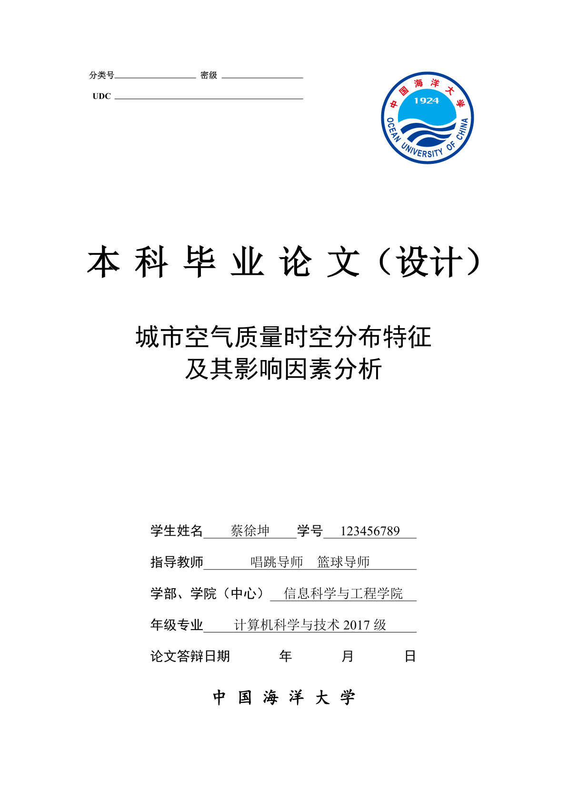
  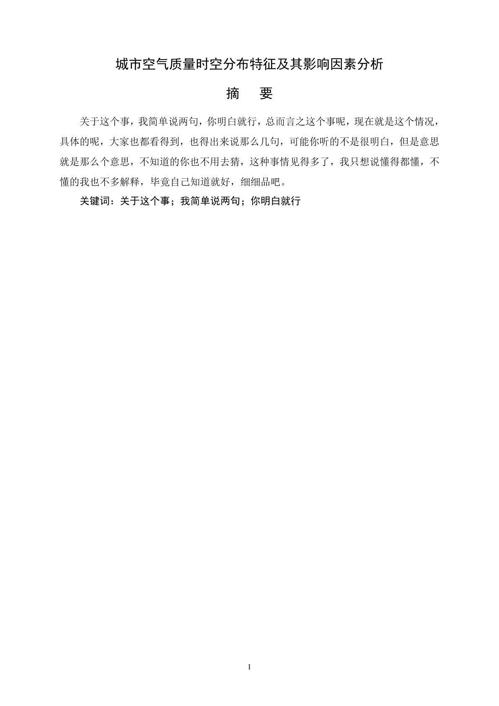
  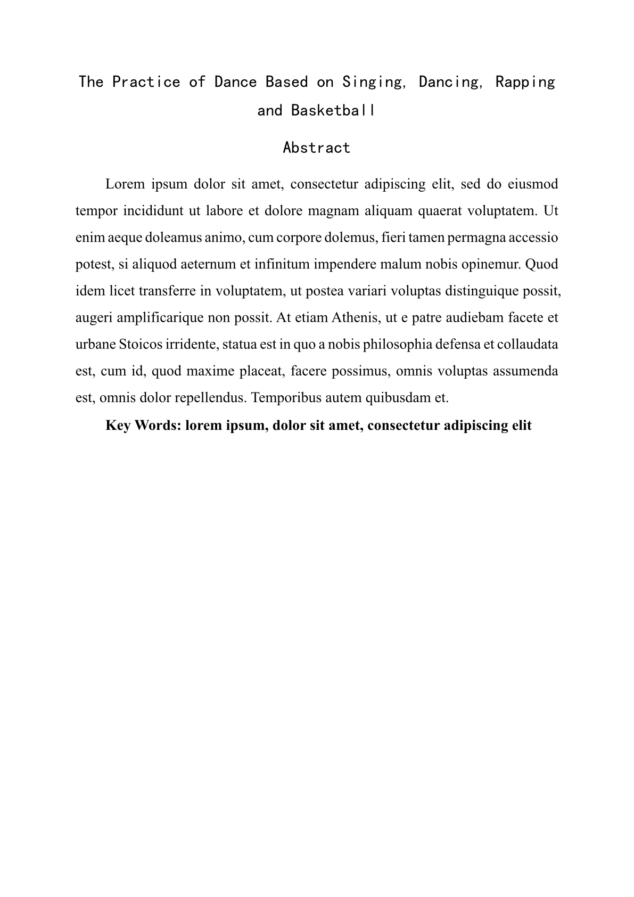
  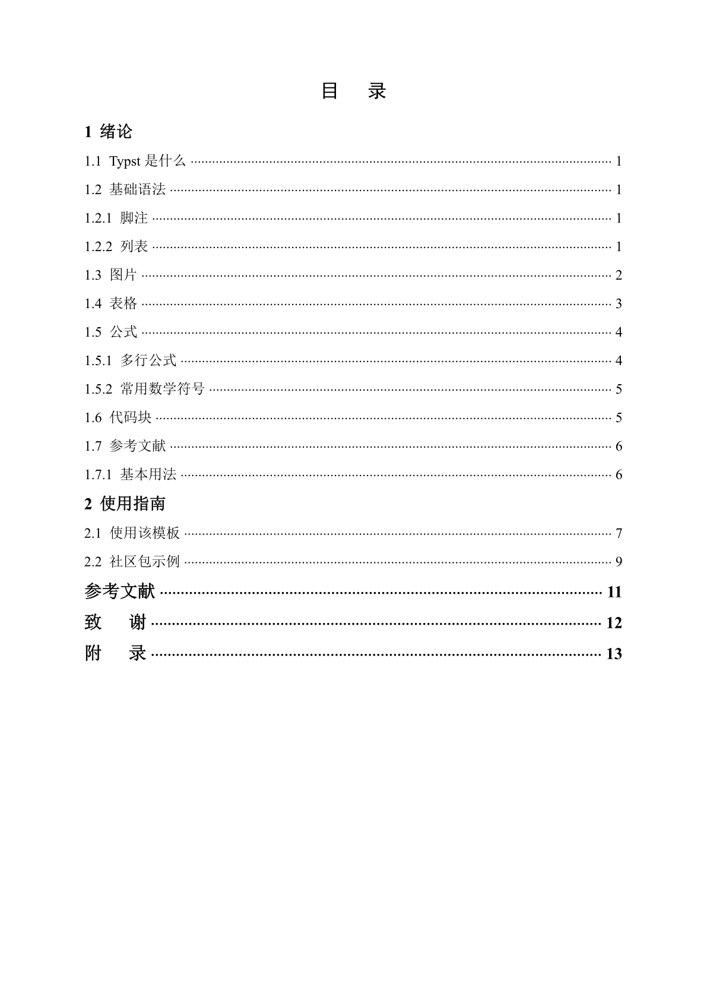
</p>

<p align="center">
  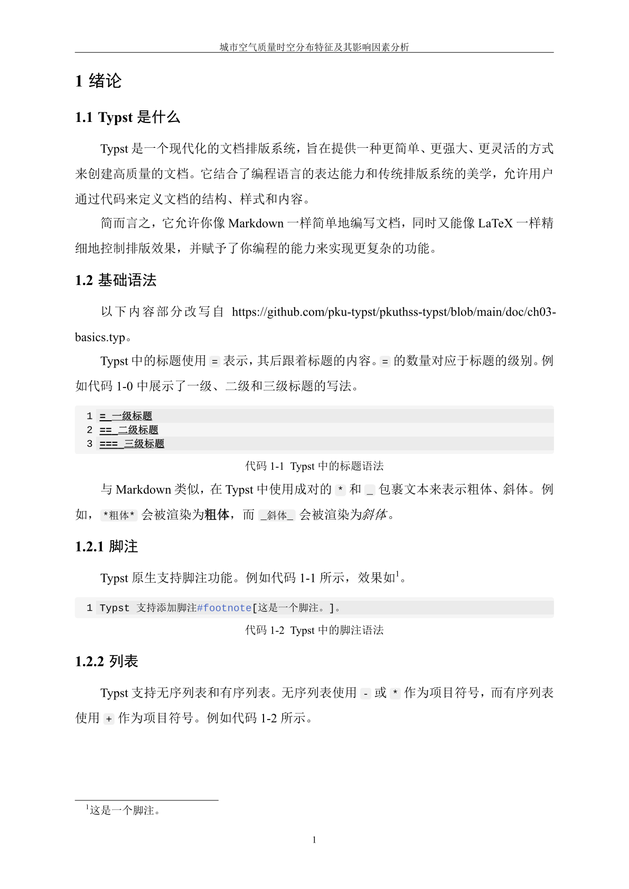
  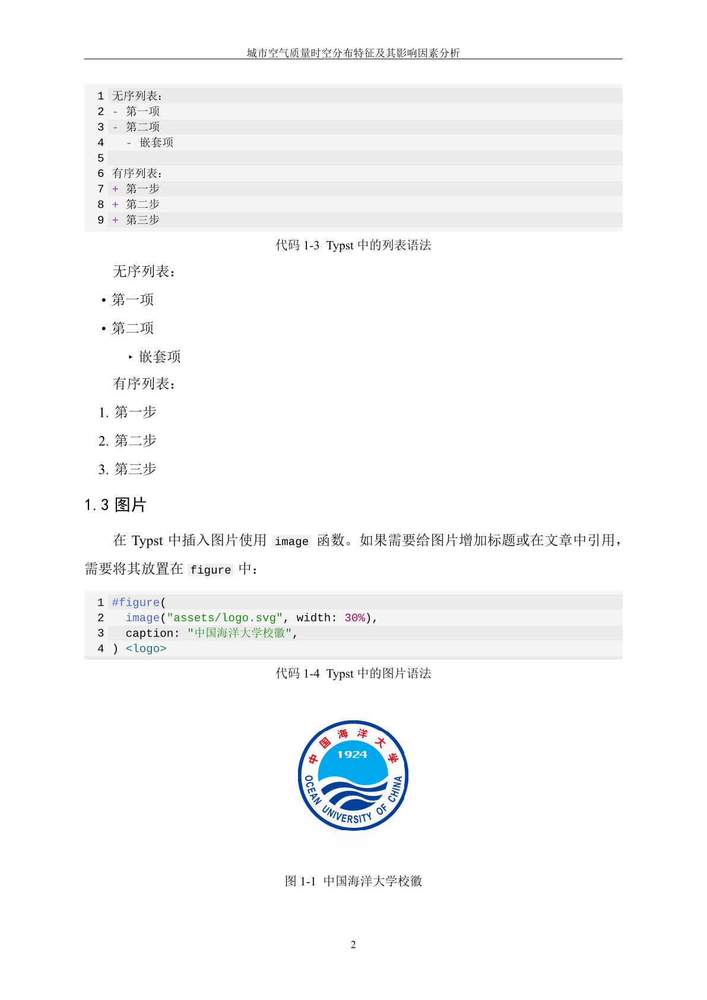
  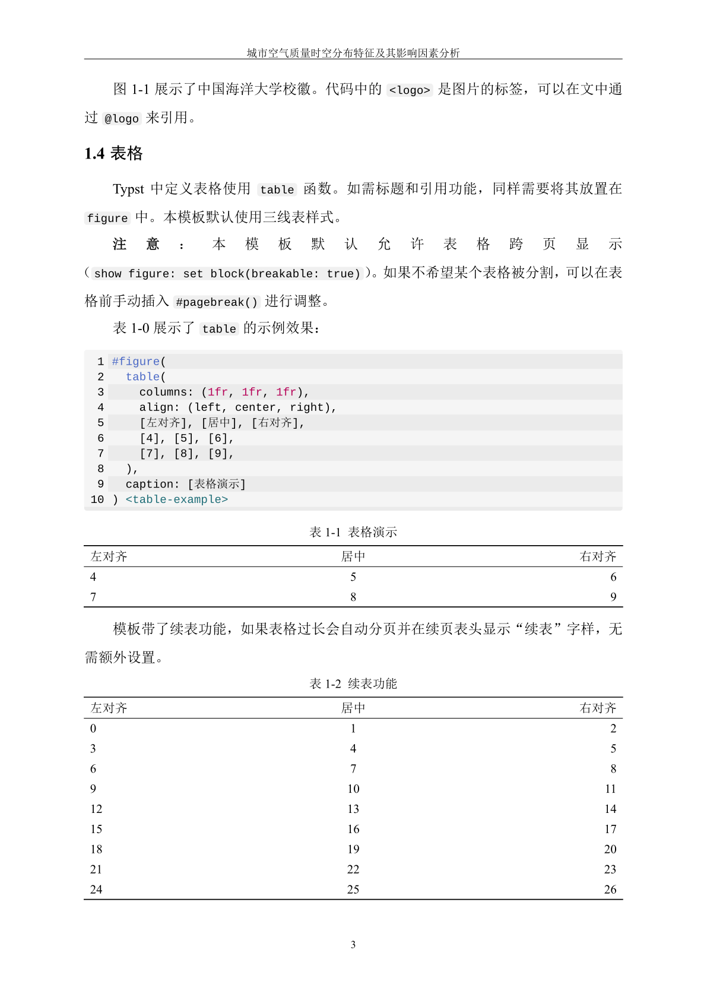
  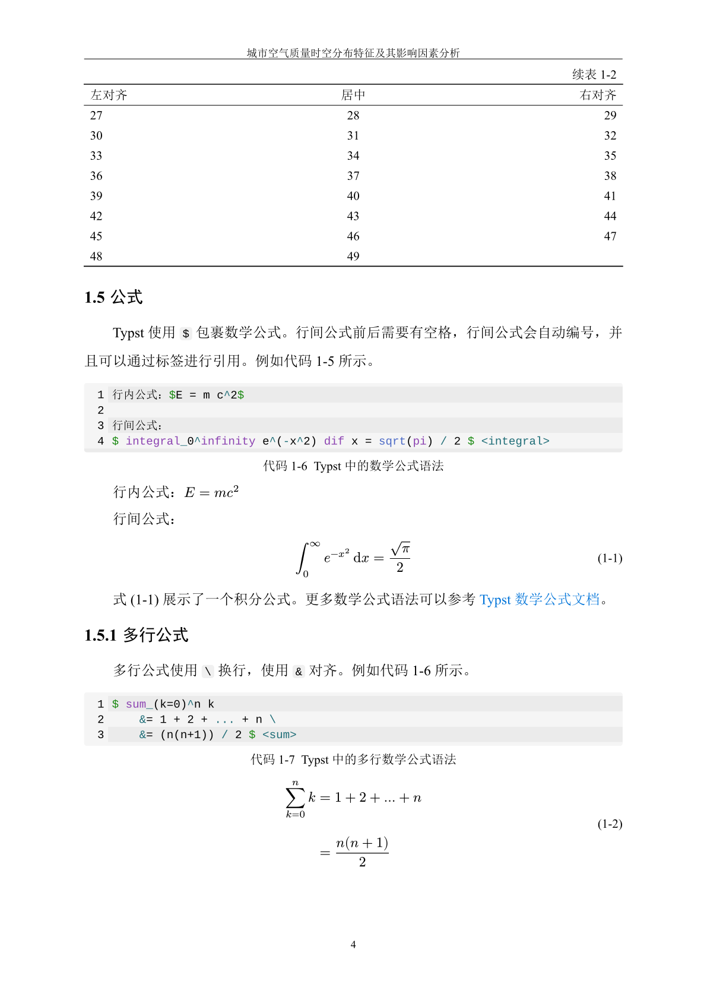
</p>

<p align="center">
  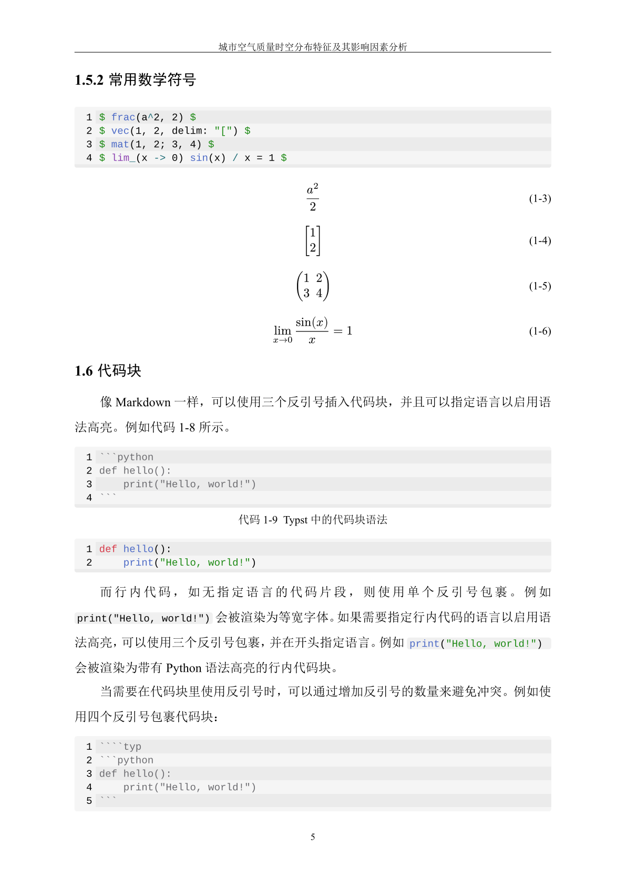
  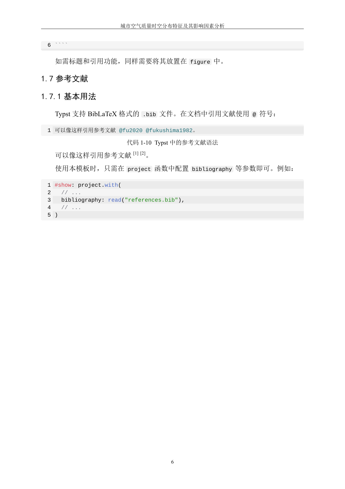
  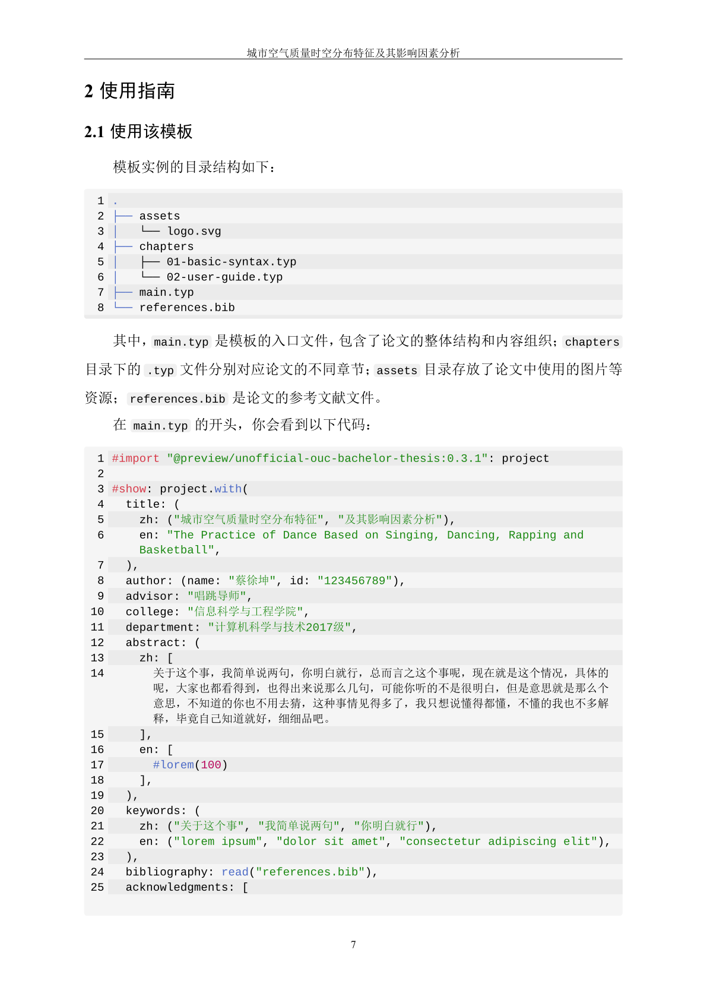
  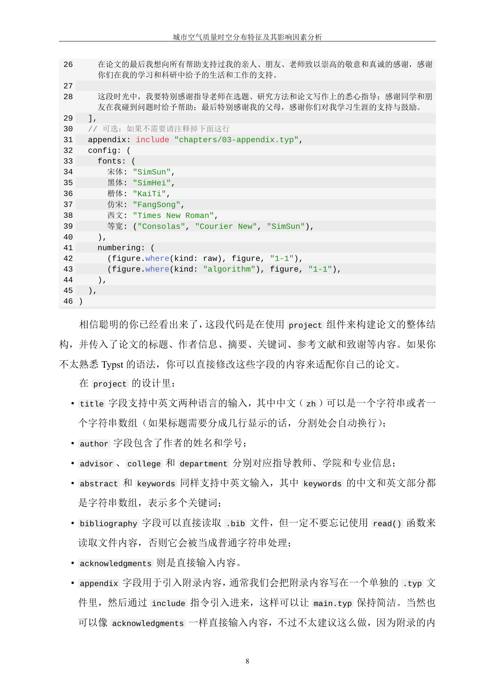
</p>

<p align="center">
  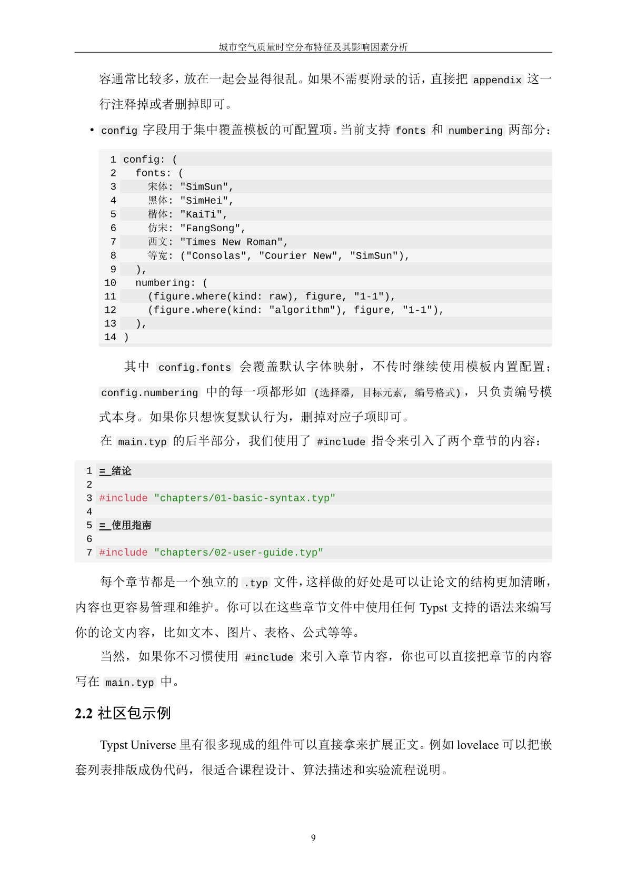
  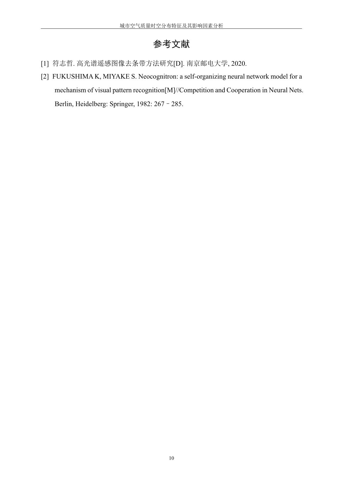
</p>


## 快速开始

> [!IMPORTANT]
> 非 Windows 用户在编译前请先安装中文字体包：
> https://github.com/hongjr03/assets/releases/download/cn-thesis-fonts-2.1-f0dde462e435/cn-thesis-fonts-2.1-f0dde462e435.zip

可以通过 Typst 命令行快速初始化论文项目：

<!-- README_INIT_CMD:BEGIN -->
```bash
typst init @preview/unofficial-ouc-bachelor-thesis:0.1.0
```
<!-- README_INIT_CMD:END -->

初始化的项目会包含 `main.typ` 示例文件。此时你需要通过 `project.with` 注入论文的基础信息：

<!-- README_MAIN_TYP:BEGIN -->
```typst
#import "@preview/unofficial-ouc-bachelor-thesis:0.1.0": acknowledgments, project

#show: project.with(
  title: (
    zh: "基于唱跳说唱篮球的舞蹈练习",
    en: "The Practice of Dance Based on Singing, Dancing, Rapping and Basketball",
  ),
  author: (name: "蔡徐坤", id: "123456789"),
  advisor: "唱跳导师",
  college: "信息科学与工程学院",
  department: "计算机科学与技术2017级",
  abstract: (
    zh: [
      出道之后，蔡徐坤大部分精力都投身于新歌的创作和专辑的打造。彼时，他需要随着 NINE PERCENT 在三个月内完成 17 场大型巡回见面会，因此写歌的时间必须挤出来。洗澡时、做造型时、飞机上、两个行程间或吃饭的空隙，只要有手机和旋律，任何地方都是他的创作场所；偶尔待在录音室里，甚至成为他的喘息时间。去年，新京报记者见到他时正值午饭，化妆室里传来哼鸣声，采访完的休息时间，我都可以写一段词。我还年轻，我觉得这都 OK。他曾表示。而《1》的发表同样违背偶像市场的规律。蔡徐坤本可以每月发一首，制造更多话题。但他认为，一首首发表并不足以让外界更全面地了解他的音乐风格，当别人都走得很快，我反而要踏誓实实一步步走。偶尔听到舆论质疑他没有作品，蔡徐坤也曾犹豫，要不要先发一部分出来？但内心却总有个声音说，你可以再多做几首不同风格的作品，让大家看到最全面、最好的你，而不是急于求成地去展现自己。
    ],
    en: [
      After his debut, Cai devoted most of his energy to the creation of new songs and albums. At that time, he needed to complete 17 large-scale tour meetings with NINE PERCENT in three months, so the time for writing songs had to be squeezed out. While bathing, modeling, on the plane, between two itineraries or meals, as long as there was a mobile phone and melody, anywhere could be his creation place. Occasionally, staying in the studio even became his breathing time. Last year, when the reporter of The Beijing News saw him, it was lunch time, and there was humming in the dressing room. He once said, I can write a paragraph during the rest time after the interview. I am still young. I think it is OK.
    ],
  ),
  keywords: (
    zh: ("蔡徐坤", "篮球", "舞台"),
    en: ("Cai Xukun", "Basketball", "Dance"),
  ),
)

// 正文
= 标题

...

// 参考文献使用 BibTeX 格式导入
#bibliography("references.bib", style: "gb-7714-2015-numeric")

// 致谢部分
#acknowledgments[
  听我说谢谢你
]
```
<!-- README_MAIN_TYP:END -->

## 许可证

本项目使用 [MIT License](LICENSE) 开源许可证。
